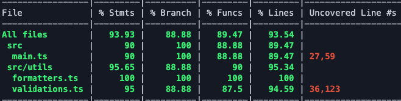

# Tech Challenge

# Como rodar o projeto
Primeiramente para instalar as dependências do projeto, execute o seguinte comando:
```bash
npm install
```

Após instalar todas as dependências do projeto, você vai conseguir buildar o projeto com o seguinte comando:
```bash
npm run build
```

E por último, você pode rodar o comando:
```bash
npm run start
```

### Caso queira rodar o projeto em desenvolvimento rode o seguinte comando:
```bash
npm run dev
```


# Como executar os testes
Para executar os testes:
```bash
npm run test
```

Para executar o coverage:
```bash
npm run test:coverage
```

## Coverage atual:
